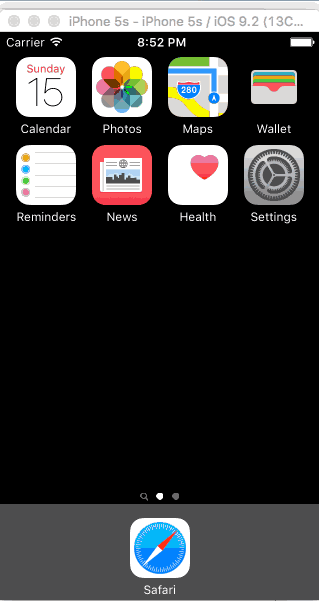
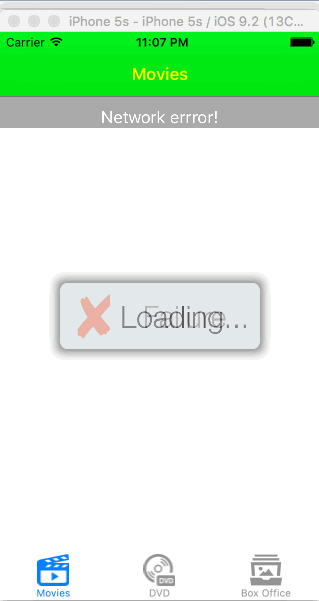

# RootenTomatoes2
Assignment Week1

Working hours: 11

* [x]  User can view a list of movies from Rotten Tomatoes. Poster images must be loading asynchronously.
  
* [x]  User can view movie details by tapping on a cell.

* [x]  User sees loading state while waiting for movies API. You can use one of the 3rd party libraries at www.cocoacontrols.com/search?q=hud.

* [x]  User sees error message when there's a networking error. You may not use UIAlertView or a 3rd party library to display the error

* [x]  User can pull to refresh the movie list. Guide: Using UIRefreshControl.

* [x]  Add a tab bar for Box Office and DVD. (optional)
	
* [ ]  Implement segmented control to switch between list view and grid view (optional)
	
* [ ]  Add a search bar. (optional)
	
* [x]  All images fade in (optional)
	
* [ ]  For the large poster, load the low-res image first, switch to high-res when complete (optional)
	
* [x]  Customize the highlight and selection effect of the cell. (optional)
	
* [x]  Customize the navigation bar. (optional)
* 

 		
